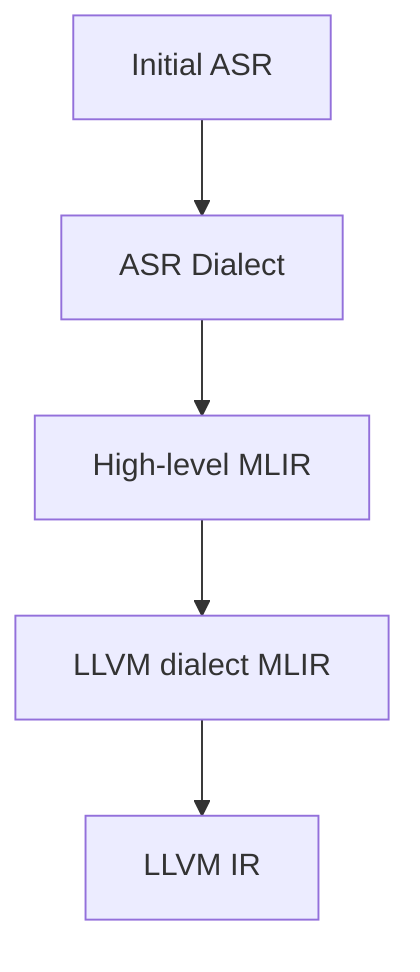
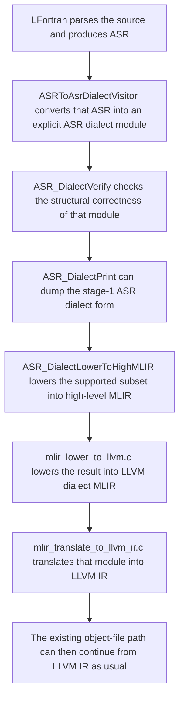

**Hours this week:** 16

**Total hours:** 53

At the end of the second week, I had the following tasks to work upon:
- Working on implementation of the ASR dialect, code cleanups and hosting a stable branch for others to test and give feedbacks for the same. 
- Working on the alternative for MachO backend, for x86_64 architecture.

This week, I completed the first task, and hosted the stable branch for others to test and give feedbacks for the same. The branch is hosted at [YashNagda17/lfortran `mlir7`](https://github.com/YashNagda17/lfortran/tree/mlir7).

During the code-cleanups, I found many issues & hackish design choices in the previous AI implementations, which were used for fast prototyping. I spent my time fixing these issues, and reviewing the architecture for the ASR Dialect support. 

In this post, I shall discuss the details of the implementation of the ASR dialect, and the support added for the same.

Starting with usage, the `new-mlir` backend supports the following flags:
- `--show-mlir-asr-dialect` to show the ASR dialect of the program.
- `--show-mlir-high-dialect` to show the high-level MLIR of the program.
- `--show-mlir-llvm-dialect` to show the LLVM dialect of the program.

To give a high level overview, starting from initial ASR, we first add support for conversion of ASR to ASR Dialect. Then, we add support for conversion of ASR Dialect to high-level MLIR. Finally, we add support for conversion of high-level MLIR to LLVM dialect. For these two steps, we make use of APIs from the [`certik/mlir`](https://github.com/certik/mlir) repository, with few changes for lfortran. Finally, we use the existing code for the `--mlir` backend, to convert LLVM dialect to LLVM IR and generate the object file.

The main pipeline is:


## High-level architecture

The implementation can be understood as following layers.

### 1. External MLIR foundation

This commit adds `certik/mlir` as a git submodule under `src/mlir/upstream`. It is the external dependency that the `mlir-new` backend builds on, including the corec runtime and the MLIR C API implementation. 

Reference commit:
- [`885213953`](https://github.com/lfortran/lfortran/commit/885213953ee174a6a9e44fcbcd76ab0219d077a9) `mlir: register certik/mlir as git submodule at src/mlir/upstream`

### 2. Hosted runtime support inside LFortran

The MLIR C API (`certik/mlir` corec) was designed for small freestanding programs, while LFortran is a normal hosted compiler binary. LFortran uses many dependencies, for memory operations and platform setup. 

Two important changes were made here:
- LFortran-specific platform files were added under `src/mlir/lfortran/corec/platform/` so hosted builds use the normal libc path for memory and platform setup. This is for operations such as memcpy, memset, mmap, mprotect etc.
- the buddy allocator was made to initialize only once, so repeated calls into the `mlir-new` pipeline in the same process does not corrupt/ crash the heap, by reinitializing the heap again and again. This might happen in the case of nested runtime builds, where the same process is used to compile multiple files.

Reference commits:
- [`e358e9477`](https://github.com/lfortran/lfortran/commit/e358e9477bf3b7cc30dabcb0cc43e007f6131c7a) `mlir: add hosted LFortran corec platform overrides`
- [`5d102ced2`](https://github.com/lfortran/lfortran/commit/5d102ced2a1439ecfb48db6f14b29fce4602b6fa) `mlir: make buddy_init idempotent for hosted MLIR use`

### 3. ASR dialect as an explicit structural IR stage 

The central architectural idea of `mlir-new` is to introduce a native ASR dialect instead of lowering ASR directly to high-level MLIR. In this design, every ASR constructor is represented as an `asr.*` operation whose structure resembles the original ASR node. This helps us to decouple the ASRv tree from the MLIR ecosystem, where changes in ASR tree needs to be supported only in the ASR dialect layer, and not in the MLIR ecosystem.

Because ASR is large, this dialect cannot be maintained manually. So the dialect shape is generated from <code class="file-ref">src/libasr/ASR.asdl</code>. A generator script <code class="file-ref">src/libasr/asdl_to_asr_dialect.py</code> reads the ASDL grammar and produces the schema, op ids, create helpers, storage tables, print helpers, and lowering dispatch headers under `src/mlir/generated/`. So, every ASR node needs matching dialect metadata, C API helpers, storage rules, print rules, lowering tables, and visitor methods for lowering. Doing that by hand will be difficult to maintain, because adding one new ASR node would otherwise require updating many separate files manually

On top of that, <code class="file-ref">src/mlir/lfortran/asr_dialect_storage_policy.h</code> defines the storage policy for fields that cannot be inferred safely from ASDL alone. This is where the design says whether a field becomes an attribute, operand, region, or symbol reference. This file is not autogenerated, and is reviewed like normal source code. ASR.asdl tells us what fields each ASR node has, but it does not say how those fields should be stored in MLIR: as attributes, operands, regions, or symbol references. For example, it lets us state clearly that DoLoop should use separate head, body, and orelse regions instead of flattening everything into operands. We classify each field into one of the following storage kinds:
- **ASR_STORAGE_ATTR** — scalars, enums, and strings (e.g. `realloc_lhs`, `kind`) are stored as MLIR attributes because they are compile-time metadata, not SSA values.
- **ASR_STORAGE_TYPE_ATTR** — optional type fields (e.g. `return_type?`) are stored as a `TypeAttr` when a type is metadata rather than the op’s primary result type.
- **ASR_STORAGE_RESULT_TYPE** — required `ttype` fields become the op’s MLIR result type so type information rides on the standard MLIR type system.
- **ASR_STORAGE_OPERAND** — single `expr` fields (e.g. `If.test`, `Assignment.value`) are stored as SSA operands so expression values flow between ops during lowering.
- **ASR_STORAGE_OPTIONAL_OPERAND** — optional `expr?` fields are stored as operands that may be absent, matching ASR’s optional expression slots without inventing dummy values.
- **ASR_STORAGE_VARIADIC_OPERANDS** — `expr` sequences are stored as variadic operands so multiple SSA values can be passed without wrapping each in its own region.
- **ASR_STORAGE_REGION** — `stmt`/`node` sequences and structural children (e.g. `Program.body`, `DoLoop.orelse`) live in named regions so nested statements and symbols stay hierarchical like ASR.
- **ASR_STORAGE_OPTIONAL_REGION** — optional structural fields (e.g. `Assignment.overloaded`) use a region that may be empty when the ASR field is absent.
- **ASR_STORAGE_SYMBOL_REF_ATTR** — symbol references (e.g. `Var.v`) are stored as `SymbolRefAttr` to point at entries in the enclosing symbol-table region.
- **ASR_STORAGE_SYMBOL_REF_ARRAY_ATTR** — symbol-reference sequences are stored as an array attribute when an op refers to multiple named symbols at once.
- **ASR_STORAGE_OMITTED** — fields such as `location`, `start_name`, and `end_name` are not stored on the op payload because MLIR already carries location separately and the other names are redundant in the dialect representation.

Together, these generated and checked-in files define the exact structure of the ASR dialect at compile time.

Reference commits:
- [`81d1f0880`](https://github.com/lfortran/lfortran/commit/81d1f0880e472ec576e9675f0ec7e9f535e85c0e) `asdl: add ASR dialect generator script`
- [`d39585cd6`](https://github.com/lfortran/lfortran/commit/d39585cd6f35846d8b5e93e5e8a8e9966e2d9e3a) `asdl: add generated ASR dialect schema and tables`
- [`557bbf067`](https://github.com/lfortran/lfortran/commit/557bbf067e5e30b9c3c29f080665b0b7198a4b28) `mlir: add ASR dialect storage policy and field readers`

### 4. Native ASR dialect runtime and lowering implementation

Next, we add the native ASR dialect runtime layer that converts the ASR Tree into the ASR Dialect in libasr to be used in the MLIR API in certik/mlir. We add the runtime layer that actually builds those ops, checks that they are structurally valid, prints them in a readable form, and lowers the supported subset further into high-level MLIR. 

The main API for the ASR dialect is initialized in <code class="file-ref">src/mlir/lfortran/asr_dialect_api.h:1</code>, which defines the stable boundary that the C++ ASR visitor can call. That header introduces `ASR_DialectOptions`, the tagged `ASR_DialectField` representation used to pass attrs, operands, and regions into op creation, and the `ASR_LoweringContext` / `ASR_SymSlot` state used during lowering. It also has a dispatch layer for the native and upstream implementations, currently disabled for upstream inside <code class="file-ref">src/mlir/lfortran/asr_dialect_api.c</code>.

The core implementation is in <code class="file-ref">src/mlir/lfortran/asr_dialect_api_native.c:232</code>. This file is where schema-driven conversion of ASR nodes to ASR Dialect ops actually happens. `ASR_DialectCreateOpNative()` looks up the op schema, decides the result type, turns scalar fields into "asr.*" metadata attributes, turns expression fields into operands, attaches region-backed fields after op creation, and finally builds the MLIR op from the generated schema description. In other words, the generator tells us what the dialect should look like, and this file is the code that creates that structure at runtime. The same file also performs a basic verification. It reads through the ASR dialect tree, checks that required fields are present, checks that region contents match the expected element kind, verifies that scopes such as Program and Function really have the expected symtab, metadata, and body regions, and then performs symbol checks so asr.expr.var references actually point to names declared in the respective symbol table.

Reference commit:
- [`d210ad9a3`](https://github.com/lfortran/lfortran/commit/d210ad9a36372fbd1835ebe5345a1f107e94b481) `mlir: add ASR dialect C API and native create/verify backend`


### 5. Lower ASR dialect to high-level MLIR and LLVM dialect MLIR

After creating the ASR dialect, we need to lower it to high-level MLIR and then to LLVM dialect MLIR. We then use APIs from the `certik/mlir` repository, to lower the high-level MLIR to LLVM dialect MLIR. Here, we also add the LFortran-specific hooks for the later lowering stages. The first part is <code class="file-ref">mlir_lfortran_hooks.c</code> and <code class="file-ref">mlir_lfortran_hooks.h</code>. These files contain LFortran specific fixes and custom handling, for handling the special cases that might arrive in high level dialect. For example, the current ASR lowering represents variables using memref<1xi32> slots, so the later LLVM-lowering stages need custom logic to load from them, store to them, and compute addresses correctly. The same files also handle things like turning vector.print into a call to printf, and fixing index and GEP details before the LLVM stage. Then <code class="file-ref">mlir_lower_to_llvm.c</code> and <code class="file-ref">mlir_translate_to_llvm_ir.c</code> implement the next two pipeline stages. The first one takes the high-level MLIR produced after ASR dialect lowering and converts it into LLVM-dialect MLIR, which is what `--show-mlir-llvm-dialect` prints. The second one takes that LLVM-dialect MLIR and translates it into LLVM IR text, which is needed for later object-file generation and for flags such as `--show-llvm`. 

Reference commits:
- [`51a5e0c98`](https://github.com/lfortran/lfortran/commit/51a5e0c98be37072e8692b6035cf906a062d4841) `build: add corec and ASR dialect MLIR CMake targets`

### 6. MLIR and LLVM bridge layer

After the ASR dialect is lowered to high-level MLIR, the pipeline still needs to move through LLVM dialect MLIR and then LLVM IR. This required both build-system support and a set of LFortran-specific files for linking the MLIR and LLVM libraries. We lower using the APIs from the `certik/mlir` repository, and once the LLVM Dialect MLIR is generated, we use the existing code for the `--mlir` backend, to convert LLVM dialect to LLVM IR and generate the object file.

The build side does three things:
- discovers and links the required static MLIR and LLVM archives
- enables the MLIR subtree only when both `WITH_LLVM` and `WITH_MLIR` are enabled
- builds the three main MLIR-side libraries needed by `mlir-new`

The runtime side adds LFortran-specific hooks for the later lowering stages:
- <code class="file-ref">mlir_lower_to_llvm.c</code> converts high-level MLIR to LLVM dialect MLIR
- <code class="file-ref">mlir_translate_to_llvm_ir.c</code> converts LLVM dialect MLIR to LLVM IR text

So this layer is used to connect all the MLIR lowering files, for LFortran builds. 

Reference commits:
- [`fc06c202f`](https://github.com/lfortran/lfortran/commit/fc06c202fb1e536c78a9f5f69f6139a5d7196963) `build: add MLIR static archive link helper`
- [`20c7228b7`](https://github.com/lfortran/lfortran/commit/20c7228b79522fb2e88c78e91b9e09de8f01e364) `build: enable MLIR in root and src CMake`
- [`51a5e0c98`](https://github.com/lfortran/lfortran/commit/51a5e0c98be37072e8692b6035cf906a062d4841) `build: add corec and ASR dialect MLIR CMake targets`

### 7. libasr integration and user-facing pipeline

The final step is integrating everything into the normal LFortran code generation flow. This happens in two parts.

First, `libasr` is linked so the new MLIR libraries and headers are visible to codegen only in MLIR-enabled builds. It also adds the `asr_to_mlir_new` files, which coordinates the full pipeline:
- initialize hosted MLIR runtime once
- run the ASR-to-ASR-dialect visitor
- verify the ASR dialect module
- lower it to high-level MLIR
- continue to LLVM dialect MLIR and LLVM IR when requested
- package stage dumps into `MLIRModule`

Second, the `ASRToAsrDialectVisitor` itself converts a real `ASR::TranslationUnit_t` into ASR dialect operations. This visitor is the bridge from typed C++ ASR nodes to the C-based ASR dialect API. It handles the structural scaffolding for programs, functions, symbol tables, bodies, and control flow, while the longer list of `visit_*` methods is generated from <code class="file-ref">ASR.asdl</code>.

Finally, the CLI and evaluator expose this pipeline to users. The new backend can now be selected with `--backend=mlir-new`, and the new stage-specific dump flags can stop the pipeline at different stages without needing a custom harness.

Reference commits:
- [`18f5c09db`](https://github.com/lfortran/lfortran/commit/18f5c09db178e706361f719b138fe8845ac9fdf6) `libasr: wire ASR dialect libraries into codegen build`
- [`2d4bec6df`](https://github.com/lfortran/lfortran/commit/2d4bec6df91d688b60610974532afeb619efc8b0) `codegen: add ASR-to-ASR-dialect visitor`
- [`f2e43b68b`](https://github.com/lfortran/lfortran/commit/f2e43b68b19cb5dd2b7c6b76492f3f516442b068) `cli: wire mlir-new backend flags and MLIRModule stage dumps`

## How the full flow works

Starting from a normal Fortran program, the flow is now:



## Commands to use the new architecture:

The main user-facing commands for this architecture are:

```bash
lfortran --show-mlir-asr-dialect a.f90
lfortran --show-mlir-high-dialect a.f90
lfortran --show-mlir-llvm-dialect a.f90
lfortran --backend=mlir-new a.f90
```
{: .playcard}

These flags correspond directly to the staged architecture described above, which is one of the main reasons the new design is easier to explain and debug. Also, the Version-0 implementation of the ASR dialect is now ready, and I have hosted the stable branch for others to test and give feedbacks for the same. The same link for the branch is [YashNagda17/lfortran `mlir7`](https://github.com/YashNagda17/lfortran/tree/mlir7).

Once this task was completed, I began to work on the second task, to figure the alternative for MachO backend, for x86_64 architecture. This might need an implementation using the `ELF` file format. This task is still in progress, and I shall update the progress here in coming weeks.

## Next Steps:

- Work on the feedback received on the ASR dialect implementation.
- Work on the `ELF` implementation as an alternative for MachO backend, for x86_64 architecture.

## Acknowledgments

A huge thanks to my mentors, [Ondřej Čertík](https://github.com/certik), [Pranav Goswami](https://github.com/Pranavchiku), [Harshita Kalani](https://github.com/HarshitaKalani) & other contributors for helping me to work on this project.
