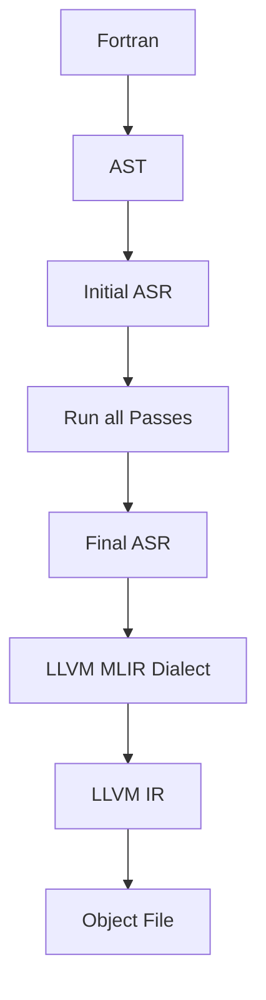

**Hours this week:** 15

**Total hours:** 68

At the end of the third week, I had the following tasks to work upon:
- Work on the feedback received on the ASR dialect implementation.
- Work on the `ELF` implementation as an alternative for MachO backend, for x86_64 architecture.

Continuing this week, as per the feedbacks, I worked on two different tasks:
- Create a fast lfortran backend using LLVM Dialect. 
- Work on the `ELF` implementation as an alternative for MachO backend, for x86_64 architecture.

### Task 1: Create a fast lfortran backend using LLVM Dialect:

For the following path:

This path was roughly implemented in the [week-2 work](../../05/week-2-gsoc/), but it was not complete and prototype based. So, this week, I worked on completing the implementation of the same, for next weeks. This path shall help us to create a faster backend for the lfortran compiler. This backend, coupled with our binary creation pipeline, shall help us to create a faster backend for the lfortran compiler. 
So, based on the feedbacks, I worked on a robust implementation of this LLVM Dialect backend, using the APIs. The commits here are arranged logically, based on few learnings from other branches as well, to make things work simpler here. Also, between the previous implementation and current work, there was a lot of implementation changes in the upstream [`certik/mlir`](https://github.com/certik/mlir) repository. So, this work involved integrating those changes as well in this implementation. Finally, using the upstream APIs in [`certik/mlir`](https://github.com/certik/mlir) this backend lowering ASR into LLVM dialect.

This work is hosted here: [mlir8-llvm-lowering](https://github.com/YashNagda17/lfortran/tree/mlir8-llvm-lowering) 

This work introduces two new baqckend options in the lfortran compiler:
- `--backend=mlir-native` to use the native backend implementation.
- `--backend=mlir-upstream` to use the upstream MLIR backend implementation from the APIs.

These helps us to compare both the backends for lfortran code for logic, performance etc. 

Few of the commits are leveraged from the previous implementations, using the learnings from those commits to make things work simpler here. This branch can be used directly in future for our own backend implementations, from LLVM Dialect. Also, it can be easier to integrate ASR dialects here as well.

This work, together with ASR dialect support, made in previous weeks, and the platform specific fixes shall give us building blocks for a new LLVM backend. These changes are still in progress and in isolation. I am exicted to make them work together, however, few changes might be needed to make this work. 

### Task 2: Work on the `ELF` implementation as an alternative for MachO backend, for x86_64 architecture.

Here, I worked on the X86 backend of the upstream [`certik/mlir`](https://github.com/certik/mlir) repository, to create a custom ELF backend for the x86_64 architecture. This backend is an alternative for the MachO backend, for the x86_64 architecture. 

This work is hosted here: [mlir8-x86-backend](https://github.com/YashNagda17/mlir/tree/x861) 

This work is similar to aarch backend, with few operational changes for x86 backend. But, by then this work was developed, [Ondřej Čertík](https://github.com/certik) made the same x86 backend changes as well, which was ultimately merged into the repository here: [PR 196](https://github.com/certik/mlir/pull/196). So, this work helped me to understand the x86 backend, but it won't be used directly used in the future work, as of now. 

Next steps: 
- Since x86 backend infrastructure is setup in `certik/mlir` repository, now I am focusing on expanding the x86 backend implementation for all tests in the repository.
- Using the LLVM Dialect path, to use the custom backend implementations. 

## Acknowledgments

A huge thanks to my mentors, [Ondřej Čertík](https://github.com/certik), [Pranav Goswami](https://github.com/Pranavchiku), [Harshita Kalani](https://github.com/HarshitaKalani) & other contributors for helping me to work on this project.